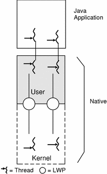
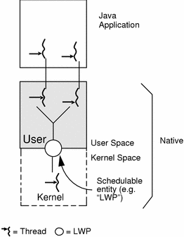

# Ch3. 하드웨어와 운영체제

## 3.1 최신 하드웨어 소개

최신 컴퓨터 시스템은 다단계 캐시, 정교한 파이프라인, 상호 연결 및 기타 명확하지 않은 성능 특성으로 인해 매우 복잡합니다.

알고리즘에 대한 O(n) 표기법과 같은 성능에 대한 고전적인 정신 모델은 이 복잡한 세상을 제대로 다루기에는 지나치게 단순한 경우가 많습니다.

반면에 멘탈 모델은 그 자체로는 존재할 수 없으며 성능 카운터의 데이터와 같은 성능 측정값과 추적 정보에 의해 정보를 얻고 보정되어야 합니다. 최신 시스템에는 데이터를 수집하는 다양한 방법이 있으므로 구조화된
방법론을 사용하여 중요한 정보에 집중하는 것이 중요합니다.

[A Mental Model of CPU Performance](https://www.youtube.com/watch?v=qin-Eps3U_E)

[Mental models for modern program tuning](https://www.youtube.com/watch?v=-Ynm2eHGAOU)

## 3.2 메모리

프로세서 코어의 데이터 수요를 메인 메모리의 데이터 공급이 충족시키지 못해 CPU는 대기해야 하는 상황이 발생했습니다.

### 3.2.1 메모리 캐시

레지스터보다는 느리지만 메인 메모리보다는 빠른 메모리 캐시가 도입되었습니다.

덕분에 프로세서 처리율은 개선할 수 있었지만 메모리에 있는 데이터를 어떻게 캐시로 가져오고 캐시한 데이터를 어떻게 메모리에 다시 써야 하는가에 대한 고민이 생겼습니다.

캐시 일관성 프로토콜을 통하여 이를 해결할 수 있었습니다.

```java
public class Caching {
    private final int ARR_SIZE = 2 * 1024 * 1024;
    private final int[] testData = new int[ARR_SIZE];

    private void run() {
        System.err.println("Start: " + System.currentTimeMillis());
        for (int i = 0; i < 15_000; i++) {
            touchEveryLine();
            touchEveryItem();
        }
        System.err.println("Warmup Finished: " + System.currentTimeMillis());
        System.err.println("Item Line");
        for (int i = 0; i < 100; i++) {
            long t0 = System.nanoTime();
            touchEveryLine();
            long t1 = System.nanoTime();
            touchEveryItem();
            long t2 = System.nanoTime();
            long elItem = t2 - t1;
            long elLine = t1 - t0;
            double diff = elItem - elLine;
            System.err.println(elItem + " " + elLine + " " + (100 * diff / elLine));
        }
    }

    private void touchEveryItem() {
        for (int i = 0; i < testData.length; i++) {
            testData[i]++;
        }
    }

    private void touchEveryLine() {
        for (int i = 0; i < testData.length; i += 16) {
            testData[i]++;
        }
    }

    public static void main(String[] args) {
        Caching c = new Caching();
        c.run();
    }
}
```

CPU 캐시 효율성과 관련되어있는 것 같습니다.

CPU 캐시라인은 대개 64바이트이고, 64바이트는 16개의 int를 담을 수 있습니다.

즉, touchEveryLine() 메서드, touchEveryItem() 메서드 모두 캐시라인을 CPU 캐시에 로드하게 됩니다.

따라서 성능 차이가 거의 없습니다.

## 3.3 최신 프로세서의 특성

### 3.3.1 변환 색인 버퍼(TLB)

### 3.3.2 분기 예측과 추측 실행

### 3.3.3 하드웨어 메모리 모델

Java Memory Model은 weak model입니다.

## 3.4 운영체제

### 3.4.1 스케줄러

green thread vs native thread

geeksforgeeks의 글
[Green vs Native Threads and Deprecated Methods in Java](https://www.geeksforgeeks.org/green-vs-native-threads-and-deprecated-methods-in-java/)





### 3.4.2 시간 문제

OS마다 시간을 측정하는 방법이 다릅니다.

### 3.4.3 컨텍스트 교환

vDSO와 같은 기술을 사용하여 컨텍스트 교환을 최적화할 수 있습니다.
